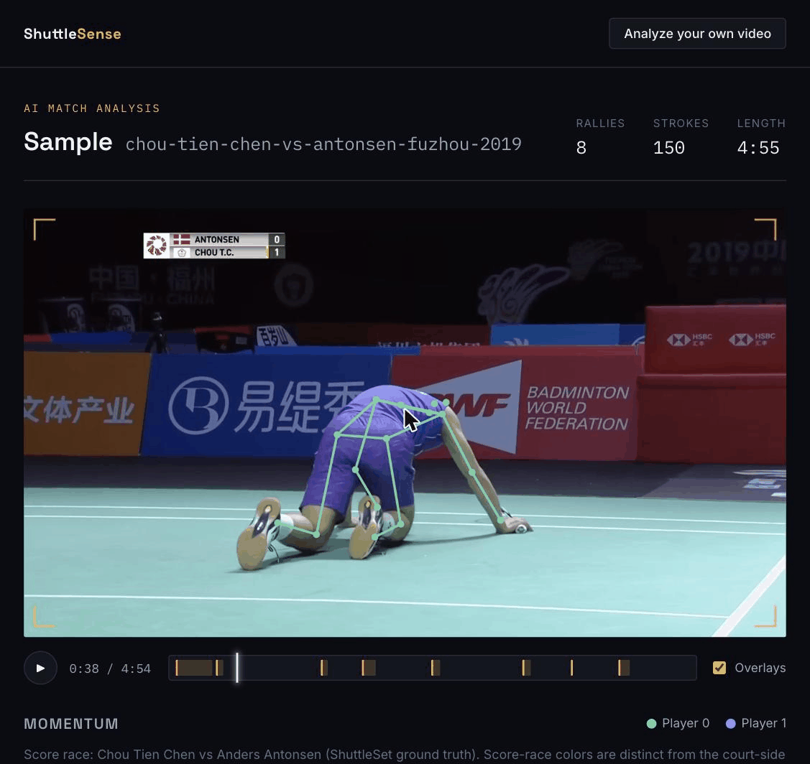

# ShuttleSense

AI badminton match analysis: upload a broadcast clip (or open a pre-baked sample) and get
per-rally segmentation, per-stroke classification (clear / smash / drop / net / lift / drive /
serve), a synced skeleton overlay on the video, a momentum/score-race chart, and a scrubbable
rally list -- all computed by a from-scratch pose -> feature -> classifier pipeline, not a
wrapper around someone else's API.



_A pre-baked sample match (Chou Tien Chen vs Antonsen, Fuzhou 2019): the trained pose→stroke
pipeline overlays both players' skeletons on the broadcast footage, and the report derives a
rally-by-rally breakdown, a momentum score-race, and a scrubbable rally explorer. Player skeletons
are colored by court side; the score-race is labeled by name — the two are deliberately kept as
separate identity axes (see "Model metrics" below for why)._

**Live demo:** **https://shuttlesense.onrender.com** — opens straight into a pre-analyzed sample
match, no upload needed. (Free-tier Render cold-starts after ~15 min idle, so the first load can
take ~40–50s.)

## What it actually does, in one sentence

Pose-extract every sampled frame with RTMPose (ONNX, CPU), turn poses into hand-built kinematic
features (`shuttlesense_core`), and feed those features to two small sequence models -- a GRU that
segments the match into rallies, and a TCN that classifies each detected stroke -- then serve the
result as a static JSON report the frontend renders on top of the original video.

## Architecture

```
                         ┌──────────────────────────────┐
   training/  (offline)  │ ShuttleSet clips + labels     │
   ───────────────────── │  -> extract_poses.py (rtmlib) │
   Python 3.11+, PyTorch │  -> features (shuttlesense_   │
   trains StrokeTCN +    │     core, shared with serving)│
   RallyGRU, exports to  │  -> train_stroke.py /         │
   ONNX via W&B artifacts│     train_rally.py (W&B)      │
                         │  -> export_onnx.py             │
                         └───────────────┬───────────────┘
                                         │ backend/models/*.onnx
                                         │ + manifest.json
                         ┌───────────────▼───────────────┐
   backend/  (serving)   │ FastAPI + onnxruntime (CPU)    │
   ───────────────────── │  upload -> worker thread ->    │
   Python 3.12, no torch,│  pose extract (rtmlib) ->      │
   no training.* imports │  shuttlesense_core features -> │
                         │  ONNX inference -> report.json │
                         └───────────────┬───────────────┘
                                         │ /api/*
                         ┌───────────────▼───────────────┐
   frontend/  (React)    │ Player + Momentum + RallyList  │
   ───────────────────── │  served as static files by the │
   Vite + React 19       │  SAME FastAPI process           │
                         └────────────────────────────────┘
```

**The train/serve split, and why it's the interesting part of this repo:** `core/
shuttlesense_core` is a single, dependency-light package that both `training/` (offline, PyTorch)
and `backend/` (online, onnxruntime, no torch) import the *exact same* feature-computation
functions from (`stroke_window`, `rally_frame_features`, `probs_to_intervals`, `suppress_events`,
`COCO_EDGES`, homography/smoothing helpers). `tests/test_consistency.py` asserts training and
serving import those functions from the same module, not two independently-maintained
implementations that could quietly drift apart -- a common, hard-to-catch bug class in ML systems
where "the model that was evaluated" and "the model that's actually running in prod" are computed
from subtly different feature pipelines. `backend/` is a hard boundary: it never imports `torch`
or `training.*`; it only ever loads the exported `.onnx` graphs + `shuttlesense_core` at runtime.

This repo ships as a **single container**: one Dockerfile builds the React frontend (Node stage)
and bundles it as static files served directly by the same FastAPI process that serves the API --
no separate frontend host, no CORS configuration, one `docker run`.

## Model metrics (honest, from `training/reports/2026-08-31-eval.md`)

Read the caveats below the table before citing any number here -- they're not boilerplate, they
materially change how strong these results actually are.

| model | metric | value |
|---|---|---|
| StrokeTCN (test, 8 classes incl. `none`) | macro-F1 | **0.405** |
| StrokeTCN (test, 7 stroke classes only, excl. `none`) | macro-F1 | **0.351** |
| LogisticRegression baseline (test, incl. `none`) | macro-F1 | 0.264 |
| DummyClassifier(most_frequent) baseline | macro-F1 | 0.083 |
| RallyGRU (test) | frame-F1 @ threshold 0.5 | **0.749** |
| RallyGRU (test) | mean temporal IoU @ threshold 0.6 (selected on VAL) | **0.528** |

Quality gate: **PASS** (TCN 0.405 > LogisticRegression baseline 0.264, the project's stated bar).

**Caveats that matter, not fine print:**

- **Selection bias, by construction.** Every training/eval segment was chosen by a
  densest-hit-window search over each match -- every window in this dataset is an
  above-average-density slice of its source match. Test-split matches were *additionally* chosen
  for clean, unobstructed 720p broadcast footage (they double as this demo's own sample videos).
  Read every number above as an **optimistic upper bound**, not a neutral held-out estimate of
  performance on arbitrary real-world footage.
- **Tiny test set.** Only 3 matches contribute to the stroke test split (N=532 windows) and 3
  matches to the rally test split -- these are not large-sample estimates; a handful of
  mispredicted rallies swings the headline numbers noticeably.
- **fps-family gap.** Source videos are 25fps or 30fps but pose-sampled at a fixed frame *step*,
  so 25fps clips are effectively sampled at 12.5Hz vs 30fps's 15Hz -- a real ~20% difference in
  how much motion each window covers. StrokeTCN macro-F1 splits as 0.355 (25fps, n=258) vs 0.442
  (30fps, n=274) on test.
- **`serve` is thin** (test n=14, val n=9) -- its per-class F1 has high sampling variance; a single
  misclassification swings it by double digits. Don't read a low/volatile `serve` score as strong
  evidence of a specific model weakness.
- **Label noise from hitter-slot selection.** 36.9% of two-candidate hit frames in training data
  had a hitter/other energy ratio below 1.5 (the heuristic used to decide which tracked player
  actually hit the shuttle) -- a plausible source of corrupted positive windows, concentrated in
  close-in net play (`net`, `lift` are also the weakest classes).
- **RallyGRU's threshold margin is small.** 0.6 beat 0.5 on validation by only 0.021 F1, on a
  validation set of just 2 matches -- 0.5 would be equally defensible; 0.6 is reported because it
  was the strict argmax under the project's own pre-registered "select on val, evaluate once on
  test" rule, not because the margin is large.

See `training/reports/2026-08-31-eval.md` for the full confusion matrix, per-match IoU breakdown,
and dataset-coverage tables (only 12 of 44 labeled ShuttleSet matches actually have video/pose
coverage; the rest are listed in the nominal train/val/test split but contribute zero rows).

## 3-minute demo script

1. **Open the URL.** The landing page is a *zero-action* demo: it fetches the list of pre-baked
   samples and immediately redirects to the first one's report -- there is nothing to click to see
   the product working.
2. **Watch the hero player.** The uploaded/sample video plays with a live skeleton overlay (COCO-17
   keypoints, both players) and a custom seek bar showing rally segments as colored bands over the
   raw timeline.
3. **Toggle overlays.** Use the player's overlay checkbox to turn the skeleton drawing on/off and
   see the raw broadcast footage underneath.
4. **Scroll to the momentum chart.** A score-race line chart (real player names, when the sample
   has ShuttleSet ground truth) tracks who's winning rallies over the match, synced to the video
   playhead.
5. **Open the rally explorer.** The rally list below is scrubbable -- click any rally to seek the
   player straight to its start frame; each rally shows its stroke sequence.
6. **Try the upload flow.** Click "Analyze your own video" in the top bar, pick a short (<95s)
   `.mp4`/`.mov`/`.mkv` clip, and submit. This runs the real pipeline (pose extraction -> feature
   computation -> ONNX inference) on CPU -- **expect this to be slow** (tens of seconds to a few
   minutes for a short clip on a free-tier CPU instance; the same pipeline that trained on a GPU
   runs pose extraction and inference on CPU-only `onnxruntime` at serve time, deliberately, so the
   container never needs a GPU). The upload panel polls job status and swaps to the report
   automatically once analysis finishes -- or shows a clear "doesn't look like a badminton match"
   error if the pipeline's own rally-detection guardrail can't find a real rally in the clip (this
   is a real, tested failure mode, not a bug -- short/atypical clips can legitimately trip it, see
   `backend/app/worker.py`'s `FRIENDLY_NO_RALLY_MSG`).

## W&B project

Training runs (stroke + rally) are logged to Weights & Biases. This environment ran in **offline
mode** (no `WANDB_API_KEY` configured) -- offline run directories are at `wandb/offline-run-*` in
this repo. _Add the synced W&B project URL here after running `wandb sync wandb/offline-run-*`
(see `NEXT-STEPS.md`)._

## Data / model provenance (DVC + W&B)

Two different mechanisms, don't conflate them:

- **DVC-tracked** (has a committed `.dvc` pointer file in git): `training/data/raw/shuttleset`,
  `training/data/processed/poses`, and `backend/samples/*/video.mp4`. No DVC remote is configured
  yet in this repo -- see `NEXT-STEPS.md` for the one-time `dvc remote add` + `dvc push` steps a
  maintainer needs to run once, after which anyone who clones the repo can `dvc pull` to fetch
  these bytes.
- **NOT DVC-tracked**: `backend/models/*.onnx` (the trained stroke/rally weights). These are
  gitignored (only `manifest.json` is committed) but have no `.dvc` pointer -- their registry of
  record is **W&B artifacts** (`stroke-tcn:latest` / `rally-gru:latest`, uploaded by
  `training/export_onnx.py --wandb`), not DVC. This training run happened in **offline W&B mode**
  (no `WANDB_API_KEY` configured in this environment -- see the W&B section above), so those
  artifacts currently only exist in the local `wandb/offline-run-*` directories (themselves
  gitignored) until someone runs `wandb sync` against a real, network-reachable W&B project. Right
  now, **the only readily available copy of the trained `.onnx` weights is the files already on
  disk in a populated working tree** (like this one) -- there is no `dvc pull` or `wandb artifact
  get` that will fetch them from a fresh clone until that sync happens. Add real model-recovery
  instructions here once `wandb sync` has been run and the artifacts are network-reachable.

**This matters for building the Docker image locally**: the Dockerfile does **not** run `dvc pull`
or fetch any W&B artifact -- it `COPY`s `backend/models/` and `backend/samples/` straight from your
local working tree's filesystem into the image. If you've just done a fresh `git clone` (as opposed
to working in this already-populated worktree), those files won't exist on disk yet and the demo
will 404 on samples/models until you either run `dvc pull` (once a remote exists, for the sample
videos) and pull/copy the `.onnx` weights from wherever they're recoverable (once W&B is synced),
or otherwise place them at their expected paths yourself before `docker build`.

## Running locally

Prerequisites: Docker. (If building outside Docker: Python 3.12, Node 20, and `ffmpeg` on `PATH`
-- the pipeline shells out to it.)

```bash
docker build -t shuttlesense .
docker run -p 8000:8000 shuttlesense
# then open http://localhost:8000
curl http://localhost:8000/api/healthz   # {"ok": true}
```

Notes on the image, if you're reading the Dockerfile:

- Multi-stage: `node:20-slim` builds the frontend (`npm ci && npm run build`); `python:3.12-slim`
  (not 3.11 -- matches this repo's actual dev venv; `core/pyproject.toml` only requires `>=3.11`,
  so 3.12 is a compatible superset) runs the backend and serves the built frontend as static files.
- `rtmlib` (pose extraction) is installed with `pip install --no-deps rtmlib` **after**
  `backend/requirements.txt`, deliberately: rtmlib's declared dependencies include
  `opencv-python`/`opencv-contrib-python` (GUI-linked builds), which would conflict with the
  `opencv-python-headless` this headless container actually needs. `--no-deps` skips rtmlib's
  declared deps entirely, so `backend/requirements.txt` explicitly lists rtmlib's *real* runtime
  needs instead (numpy, onnxruntime, opencv-python-headless, and `tqdm` -- the last one is easy to
  miss: rtmlib's own `__init__.py` unconditionally imports a submodule that needs `tqdm`, even
  though this codebase only ever uses `from rtmlib import Body`). The Dockerfile has a build-time
  self-check (`RUN python -c "import rtmlib; ..."` + a `pip show opencv-python` assertion) that
  fails the build immediately if this ever regresses, rather than surfacing as a runtime crash.
- Runs as a non-root user (`appuser`, uid 1000); `/app/data` (job uploads/outputs, sqlite db) is
  writable by it, everything else in the image is not.
- `SHUTTLESENSE_STATIC_DIR=/app/static` (note the `SHUTTLESENSE_` prefix -- `backend/app/
  config.py`'s `Settings` only reads env vars with that prefix; a bare `STATIC_DIR` is silently
  ignored) is what tells the backend to serve the built frontend instead of running API-only.

## Deploying (Render)

`render.yaml` is a ready-to-use blueprint (Docker runtime, free plan, health check
`/api/healthz`). To actually deploy: push this repo to a public GitHub repo, then create a Render
Blueprint deploy pointing at it. See `NEXT-STEPS.md` for the exact commands -- pushing to GitHub
and creating the Render service are the two steps that need your own credentials/browser auth, so
they're not automated here.

## What I'd do next (Phase 2)

- **Shuttle tracking** (TrackNet-style heatmap regression) -- the biggest missing signal. Right
  now stroke/rally models only ever see player pose, never the shuttle itself, which caps how much
  a classifier can distinguish e.g. a fast drop from a slow smash without seeing shuttle velocity.
- **Court-relative features / placement heatmaps** -- once shuttle tracking exists, per-rally shot
  placement heatmaps (a genuinely new visualization, not just a better stat) become possible. This
  was deliberately deferred out of Phase 1 (see the plan's Global Constraints) rather than bolted
  on half-working.
- **Domain-gap eval** -- current metrics are all on ShuttleSet-family broadcast footage, chosen for
  clean, unobstructed camera angles. A real "does this generalize" answer needs eval on footage
  this pipeline wasn't tuned against at all (different camera height/angle, non-broadcast venues).
- **Fix the hitter-selection heuristic** -- the energy-ratio hitter picker is noisy on ~37% of
  two-candidate hits; a learned hitter-assignment model (rather than a hand-tuned energy heuristic)
  is the highest-leverage single fix for stroke label quality, and label quality is very plausibly
  the ceiling on the current 0.351 stroke-only macro-F1, not model capacity.
- **GPU-backed serving tier** -- CPU-only `onnxruntime` inference keeps the container simple and
  free-tier-deployable, but is the main reason upload analysis is slow; a paid tier with GPU
  inference would turn "upload and wait a few minutes" into "upload and wait a few seconds."
